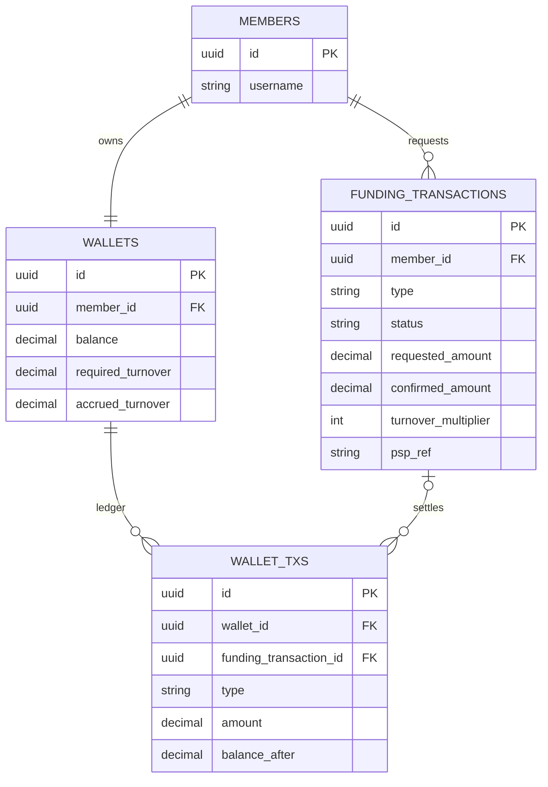
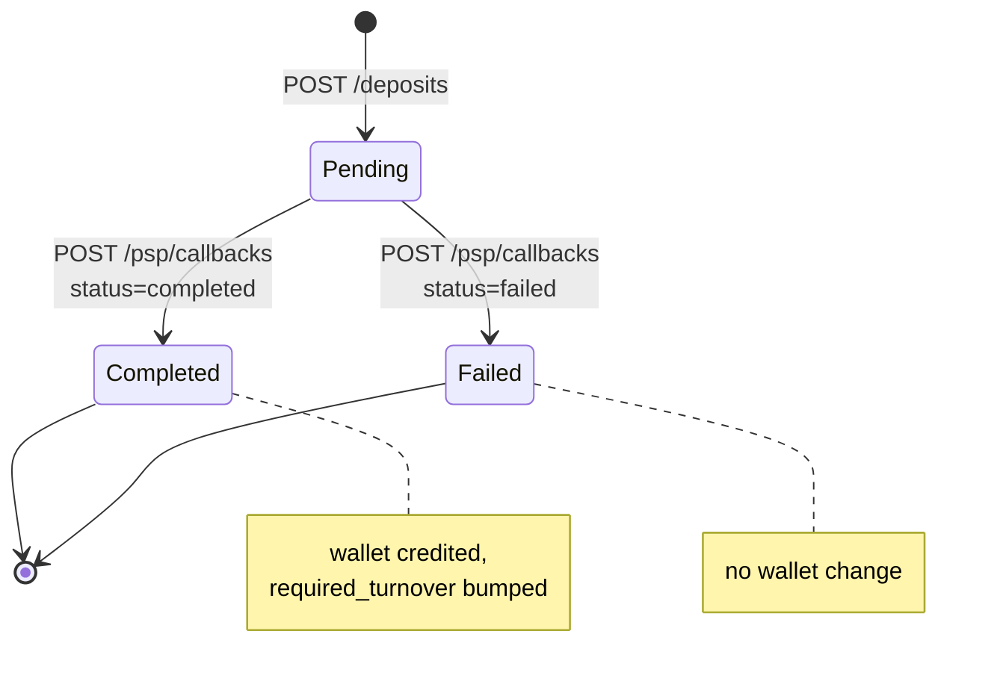
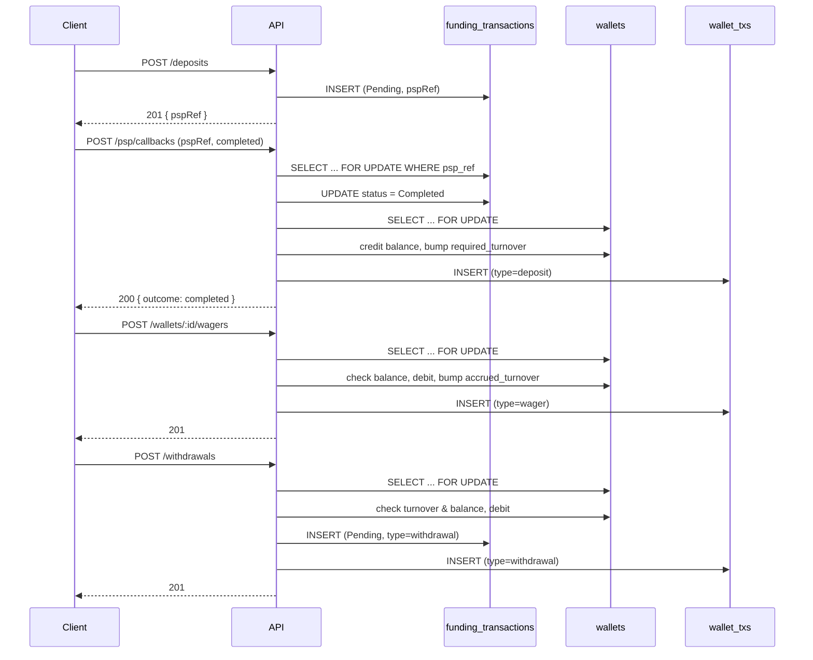

# Architecture

Reference doc for how the deposit → wager → withdrawal flow is put together. Not a required
deliverable for the take-home (see `readme.md`'s deliverables list) — added alongside
`DECISIONS.md`/`DESIGN-PSP.md` as a map of what actually shipped.

## Data model

- **`wallets`**: `balance`, plus two denormalized counters, `required_turnover` and
  `accrued_turnover`, updated in lockstep with the balance changes that move them.
- **`funding_transactions`**: one row per deposit or withdrawal request. `type`
  (`deposit`/`withdrawal`), `status` (`pending`/`completed`/`failed`), `requested_amount`,
  `confirmed_amount` (deposits only, filled by the PSP callback), `turnover_multiplier`, `psp_ref`
  (unique, deposits only).
- **`wallet_txs`**: one append-only row per balance movement. `type` (`deposit`/`withdrawal`/
  `wager`), signed `amount` (+credit/−debit), `balance_after` snapshot, optional
  `funding_transaction_id` (null for wagers, which have no funding transaction). A wallet's
  `balance` is always re-derivable as `SUM(amount)` over its `wallet_txs` rows.

## Funding transaction state machine

Both `Completed` and `Failed` are terminal. A callback that repeats the transition already applied
is a no-op (`200`, idempotent); a callback that contradicts the terminal state is rejected (`409`,
row untouched). Withdrawals use the same table with `type='withdrawal'`, created directly in
`Pending` (no PSP callback path here — see `readme.md`'s "assume a human approves it later").

## Locking strategy

Every code path that mutates a wallet's balance or a funding transaction's status does so inside
one `sequelize.transaction`, having first taken `SELECT ... FOR UPDATE` on the row it's about to
change:

| Endpoint                   | Row locked                          | Why                                                                                                                          |
| -------------------------- | ----------------------------------- | ---------------------------------------------------------------------------------------------------------------------------- |
| `POST /psp/callbacks`      | `funding_transactions` by `psp_ref` | Concurrent deliveries of the same callback serialize on this lock; the loser re-reads the already-applied status and no-ops. |
| `POST /wallets/:id/wagers` | `wallets` by id                     | Concurrent wagers on the same wallet serialize; the loser re-reads the post-debit balance before its own check.              |
| `POST /withdrawals`        | `wallets` by member                 | Same reasoning — turnover/balance check and the debit happen against a locked, consistent snapshot.                          |

Optimistic locking (version column + retry) was considered and rejected — see `DECISIONS.md` for
why pessimistic row locks fit this workload better.

## Request flow: deposit → wager → withdrawal

Each of the four requests above runs inside a single DB transaction — either everything in that
step commits, or none of it does.

## Where to look

- `src/services/walletService.ts` — the shared locking + ledger-writing primitives
  (`lockWallet`, `creditWallet`, `debitWallet`) that every money-moving path builds on.
- `src/services/fundingTransactionService.ts` — the state machine and the deposit/withdrawal
  flows.
- `src/lib/money.ts` — BigNumber conventions; all arithmetic in the services above goes through
  `dec()`.
- `test/deposits.test.ts`, `test/wagers.test.ts`, `test/withdrawals.test.ts` — including the
  concurrent-duplicate-callback and concurrent-overdraw tests that exercise the locking above
  against a real Postgres instance (`Promise.all` of two live HTTP requests, not mocked).
