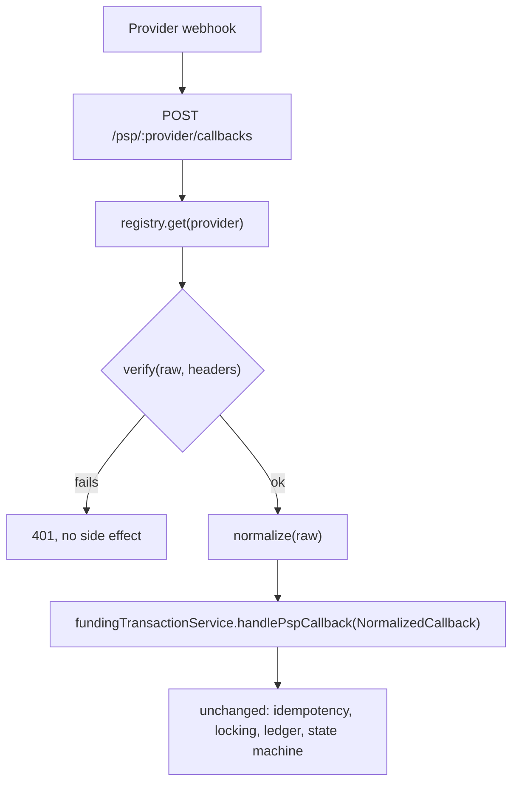

# Design note: the 50th PSP

## Goal

Adding PSP #50 should mean: write one adapter file that maps that provider's wire format to a
fixed internal shape, register it under a config key, and pass a fixture-based contract test —
without touching routes, services, the state machine, or any other adapter.

## The abstraction

```ts
interface NormalizedCallback {
  pspRef: string;
  status: 'completed' | 'failed';
  amount: string;
  raw: unknown;
}

interface PspAdapter {
  readonly name: string;

  /**
   * Verifies the callback's authenticity (signature/HMAC/etc). Everything an
   * adapter needs to verify (secret, header names, algorithm) comes from its
   * own config block - callers never see provider-specific verification detail.
   *
   * @param rawBody - The raw request body, unparsed.
   * @param headers - The request headers.
   * @returns Whether the callback's signature checks out.
   */
  verify(rawBody: Buffer, headers: Record<string, string>): boolean;

  /**
   * Maps the provider's payload into our fixed shape: status vocabulary
   * translation ("succeeded"/"SUCCESS"/"00" -> 'completed'),
   * minor-units-to-decimal conversion, whatever quirks that provider has.
   * This is the ONLY place that knows them.
   *
   * @param rawBody - The raw request body, unparsed.
   * @returns The normalized callback.
   */
  normalize(rawBody: Buffer): NormalizedCallback;
}
```

`src/psp/registry.ts` maps `name -> PspAdapter` (a plain object literal, populated at startup from
config - no dynamic loading magic). The mock PSP already in the exercise becomes
`src/psp/adapters/mockPsp.ts` implementing this interface, alongside `stripe.ts`, `adyen.ts`, etc.
as they're added.

## Where things live

- **Route**: `POST /psp/:provider/callbacks` — one route, not one per PSP. It looks up the adapter
  by `provider`, calls `verify` then `normalize`, and hands the `NormalizedCallback` to the
  existing `fundingTransactionService.handlePspCallback` unchanged. The service layer (state
  machine, locking, idempotency, ledger) never sees a provider-specific shape or format, so PSP
  #50 cannot regress PSP #1-49's correctness-critical code.
- **Verification**: inside the adapter, using per-provider config (secret, header name, algorithm).
  Config-driven so a junior engineer adds a new entry to `config/psp.ts` (or env vars,
  `PSP_STRIPE_SECRET` etc.) rather than writing new verification code where possible — most
  providers use HMAC-over-raw-body-with-a-header, which can be a shared helper the adapter calls
  with its own secret/header name.
- **Normalization**: entirely inside the adapter's `normalize()`. This is where "sends amounts in
  minor units," "uses `succeeded` instead of `completed`," "sends an extra `pending` webhook we
  should ignore" all get handled, one provider at a time, with no shared conditional logic that
  grows a branch per provider.
- **Config**: one block per provider (secret, base URL if we ever need to call out, status
  vocabulary mapping if it's simple enough to be data instead of code). A new PSP is: one adapter
  file + one config block + one registry entry.

## Testing without live calls

Every adapter ships with **fixture-based contract tests**: a folder of recorded real (or
provider-doc-derived) payloads — `completed.json`, `failed.json`, `duplicate.json`, `bad-sig.json`
— run through `verify`/`normalize` and asserted against the expected `NormalizedCallback`. These
run in CI with no network access, since they're just JSON fixtures on disk. The **shared** contract
test suite in `src/psp/contractTest.ts` (parameterized over "give me an adapter + a fixtures dir")
runs the same set of assertions against every adapter — every PSP has to at minimum:
normalize a completed callback correctly, normalize a failed one, reject a bad/missing signature,
and produce a decimal-string amount in major units regardless of what the wire format used. A
junior engineer adding PSP #50 writes fixtures + the adapter; the contract suite catches the
"forgot to convert minor units" class of bug for free, and there's no code path in that suite that
touches a real network.

## One-day-task sketch

1. Drop the provider's sample webhook payloads (completed, failed, duplicate, malformed) into
   `src/psp/adapters/__fixtures__/<provider>/`.
2. Write `<provider>.ts` implementing `PspAdapter`: `verify()` (usually a one-liner calling the
   shared HMAC helper) and `normalize()` (status/amount mapping).
3. Add a config block with the provider's secret/header name.
4. Register it in `registry.ts`.
5. Run the shared contract suite against the new fixtures - green means it's wired correctly.
6. No route, service, or migration changes required.


